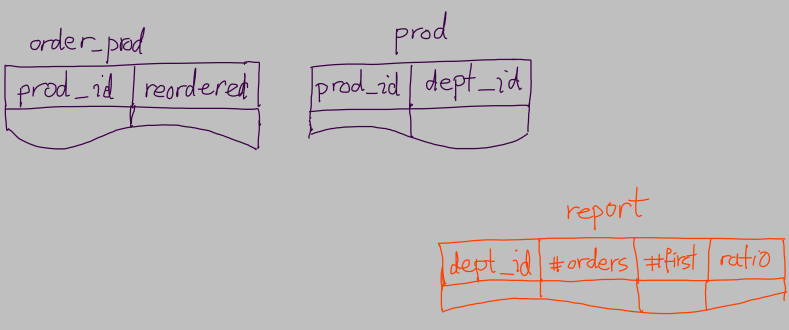

# Solution to Purchase-Analytics in Python

A solution to the [Purchase Analytics](https://github.com/InsightDataScience/Purchase-Analytics) challenge in Python.

## Approach

When thinking about how to solve this problem, we like to think of our three comma separated files as tables.  So we have three tables;  two input tables which are order_products table and products table, and one report table.  To gain a clear understanding of our approach, we imagine each table containing only the fields required to tackle our specific problem. 

We first go over `order_products` table row by row, read the `product_id` and look for the `product_id` in `products` table.  We could do this the other way around, but we prefer to first go over the longer table *row by row* and then *search* in the shorter table.  Searching can be computationally expensive, so we prefer to search the shorter table rather then the longer one, although it comes at the cost of searching many more time (look at [Scalability](README.md#scalability)).  Notice that `order_products` table can have tens of millions rows while `products` table tend to have no more than tens of thousands rows.  We will perform a high number searches each of which will be relatively fast.

## Algorithm

    For each row in order_products table:
        Read the product_id and `reordered` value
        In products table, find the dept_id associated with the product_id
        In report table, find the row associated with the dept_id
            If dept_id doesn't exist, create a row for it
            Increment number_of_orders
            If `reordered` is 0
                Increment number_of_first_orders
    Compute ratio for each row in report table
    Sort report table based on dept_id

## Design

Before designing a bunch of data structures for each table, we tried to think of *abstract data types* that our program can utilize.  We also tried to think of any abstractions that could cover common attributes of those data types.

We used a dictionary of `product_id: dept_id` pairs to represent the products table because we like to search any `product_id` as fast as possible.  We need to search the products table for potentially millions of `product_id` s (look at [Scalability](README.md#scalability) for a discussion on the tradeoff involved).

Similarly, as we need to 

Since each data structure is so simple (each has about a couple instance variables), there seems to be no common attributes between them.  So we do *not* need to design a class hierarchy using an *abstract class*.

The only useful abstractions we could think of are the following:

1. `products` which keeps track of a collection of products.
2. `dept` which represents the four variables that interests us about a department.
3. `depts` which keeps track of a collection of `dept`s.

## Scalability

Since there are no more than a few dozen departments, we can sort the report table based on departments really fast in the end--right before generating a report.  But as we create and update the report table, we need to search the report table many times -- once for each product of which there are tens of thousands.  So to reduce the time complexity of search, we better use a hash table for report table.  So we use a Python dictionary to store the report table.

We use a hash table (a Python dictionary) to store the order_product tables as well.  Because for each product (of which there are tens of thousands), we need to search the product in the order_product table which may contain tens of millions of orders.

A Python dictionary uses hash map techniques to achieve (almost) constant time complexity, O(1), to search for a key (or a value).  That is, the search complexity would be (almost) independent of the number of elements in the dictionary.

We used `str` keys in our dictionary because it leads to the fastest performance--according to Python time complexity wiki (page)[https://wiki.python.org/moin/TimeComplexity].

## Test

*Integration test* had already been set up in `insight_testsuite/run_tests.sh`.  We just added more test cases in `insight_testsuite/tests/`.  We also wrote *unit tests* using the standard Python test framework `unittest`.
